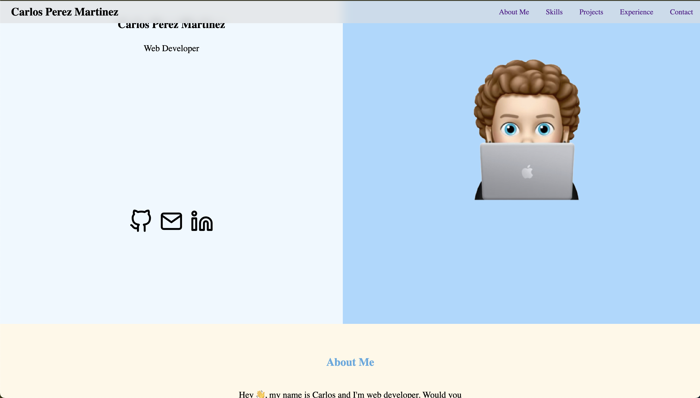
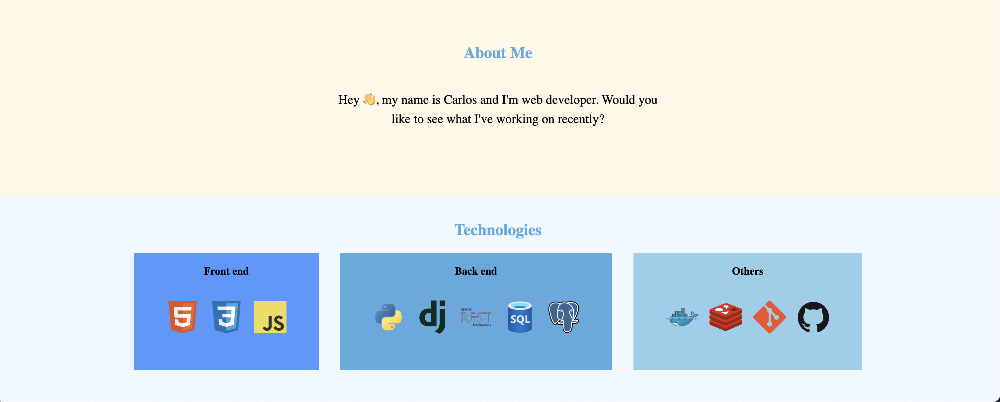
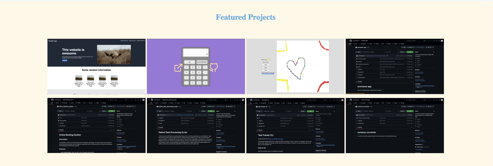

# Portfolio Web Project

## Description
This respository contains my personal portfolio webpage, showcasing my projects
and work experience.
This webpage is built only with HTML and CSS.

## Features
- **Projects**: Display a collection of my projects with screenshots, links to the source code and to the live project.
- **Work Experience**: Present work history, including roles, responsibilities, and accomplishments.
- **Interactive Interface**: Utilize CSS to create dynamic and responsive user interactions for seamless navigation.
- **Visual Appeal**: Design the website with a modern and visually appealing layout to engage visitors.
- **Accessibility** : Take into account all type of users, regardless they are  using a phone, a tablet or a computer. 

## Usage
1. Explore the different sections of the webpage, including about me, projects, and work experience.
2. Hover over  projects images to view links to the preview and source code.
3. Navigate through the page using the navigation menu.
4. Contact me through the provided contact links to social media profiles or
   email.

## Example
To illustrate the usage of the portfolio website, let's consider a visitor browsing through my projects:

1. The visitor lands on the homepage and navigates to the projects section.

2. They hover over a project image to view more details.

3. The project displays links to GitHub repositories and live demos.

## Contributing
Feedback and contributions to enhance my portfolio website are appreciated! To contribute:
1. Fork the repository.
2. Make your changes, whether it's updating content, or improving design.
3. Submit a pull request with a clear description of your contributions.
4. I have my own issues created in case you would like to take one of them too.

## License
This project is licensed under the [MIT License](LICENSE).

## Credits
- Created by [Carlos Perez](https://github.com/carlosmperezm)
- Inspired by the need to showcase professional portfolio and achievements.

## Contact Information
For inquiries, collaborations, or feedback, please contact [carlosperezmartinez2901@gmail.com](mailto:carlosperezmartinez2901@gmail.com).

